# Phase 2 ERD

From `prisma/schema.prisma`. Businesses associate via `business_professionals` (M:N).

```mermaid
erDiagram
  users ||--|| profiles : "1:1"
  users ||--o{ user_roles : has
  roles ||--o{ user_roles : assigned
  roles ||--o{ role_permissions : grants
  permissions ||--o{ role_permissions : granted
  users ||--o{ notifications : receives
  users ||--o{ consents : records
  users ||--o{ audit_logs : "actor optional"

  profiles ||--|| professional_details : "1:1"
  profiles ||--o{ experiences : professional_only
  profiles ||--o{ profile_skills : ""
  skills ||--o{ profile_skills : ""
  profiles ||--o{ profile_services : ""
  services ||--o{ profile_services : ""
  profiles ||--o{ business_professionals : ""
  businesses ||--o{ business_professionals : ""
  industries ||--o{ businesses : classifies
  profiles ||--o{ opportunities : intents
  profiles ||--o| church_information : "service_area only"
  profiles ||--o{ documents : metadata
  businesses ||--o{ documents : "optional"

  profiles ||--o{ verification_records : "XOR subject"
  businesses ||--o{ verification_records : "XOR subject"
  users ||--o{ verification_records : reviews

  profiles ||--o{ publications : "XOR + resulting_visibility"
  businesses ||--o{ publications : "XOR subject"

  profiles ||--o{ admin_notes : "XOR subject"
  businesses ||--o{ admin_notes : "XOR subject"

  profiles ||--o{ spotlights : editorial
```

Directory is **not** a table. Query: `visibility_status = DIRECTORY` AND `verification_status = VERIFIED`.
